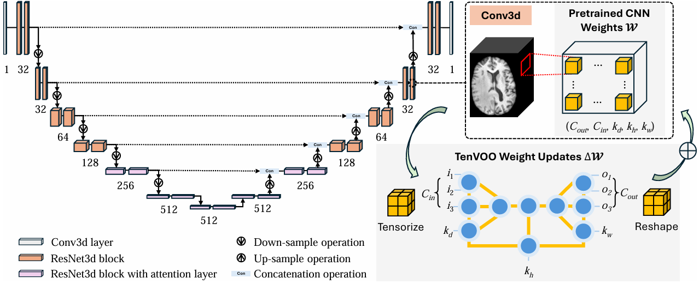
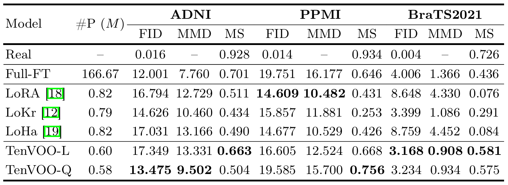

# Parameter-Efficient Fine-Tuning of 3D DDPM for MRI Image Generation Using Tensor Networks

<p align="center">
  <a href="https://arxiv.org/abs/xxxx.xxxxx">
    
  </a>
  <a href="[https://github.com/TUAT-Novice/tenvoo/](https://github.com/xiaovhua/tenvoo)">
    
  </a>
</p>


<!--  -->


### This repository contains the official implementation of **"Parameter-Efficient Fine-Tuning of 3D DDPM for MRI Image Generation Using Tensor Networks"**.

### Congratulations !! Our work is early accepted by **MICCAI 2025** 🎉🎉


## 🔍 Introduction



This repository provides the official implementation of **Tensor Volumetric Operator (TenVOO)**, a novel parameter-efficient fine-tuning (PEFT) method specifically designed for 3D convolutional networks. TenVOO enables efficient adaptation of large-scale 3D models while preserving spatial interactions, and demonstrates strong performance across various Magnetic Resonance Imaging (MRI) generation tasks.

**Key highlights:**

- 🧠 Introduced tensor decomposition-based PEFT, TenVOO, for 3D CNNs  
- 📦 Compatible with standard 3D backbones (e.g., 3D UNet)  
- 📈 Significant reduction in trainable parameters without compromising spatial understanding

## 📁 Repository Structure

```bash
.
├── media/                # Image and video for this repository
├── prepare/              # Details for environment setup and data preparation
├── peft/                 # PEFT codes for fine-tuning
├── scripts/              # Training and evaluation scripts
├── dataset.py            # Define Dataset and DataLoader class
├── ddpm_unet.py          # Define the MONAI DDPM model
├── pretrain_ddpm.py      # Code for pretraining DDPM
├── ft_ddpm.py            # Code for fine-tuning DDPM
├── eval.py               # Code for model evaluation
├── utils.py              # Utilities
├── med3d.py              # Define the Med3D, only for eval.py
├── toy.ipynb             # A simple tutorial on how to fine-tune Conv3D using our TenVOO framework
└── README.md             # Project description
```

## 🚀 Getting Started

### 1. Clone the repository

```bash
git clone https://github.com/TUAT-Novice/tenvoo.git

cd tenvoo/
```

### 2. Set up environment & Prepare data

Please refer to [`./prepare`](./prepare)

### 3. Train the model

To train your MONAI DDPM, you can modify the config in  [`./scripts/run_pretrain_ddpm.sh`](./scripts/run_pretrain_ddpm.sh), then run:

```bash
bash scripts/run_pretrain_ddpm.sh
```

To fine-tune based on a pre-trained DDPM, please modify the config in  [`./scripts/run_ft_ddpm.sh`](./scripts/run_ft_ddpm.sh), then run:

```bash
bash scripts/run_ft_ddpm.sh
```

To evaluate the DDPM, please modify the config in  [`./scripts/run_eval.sh`](./scripts/run_eval.sh), then run:

```bash
bash scripts/run_eval.sh
```

Please make sure to specify the correct ```unet_ckpt``` path when fine-tuning or evaluating your model.

## 🎓 Tutorial & Quick Start

**Tutorial**

You can follow our example from [`./toy.ipynb`](./toy.ipynb), to learn how to fine-tune your pre-trained 3D model with the TenVOO framework.

**Quick Start**

You can easily apply TenVOO to your own 3D models with just a few lines of code.

```python
import torch
from peft import TenVOOConfig, TenVOOModel, TENVOO_LIST
from utils import peft2nnmodel, save_peft, load_peft

model_ckpt = /path/to/your/pretrained/model.pth                          # Replace with your model path
peft_ckpt = /path/to/save/peft/weights.pth                               # Replace with your path to save peft weights
device = torch.device('cuda' if torch.cuda.is_available() else 'cpu')

# 1. Load your base model (must be a compatible 3D model, e.g., UNet3D)
model = load_your_model(model_ckpt)  

# 2. Define which layers to wrap with TenVOO
target_modules = [".*resnets.*.conv1.conv", ".*resnets.*.conv2.conv"]    # Replace with actual layer names in your model

# 3. Create TenVOO config and wrap the model
config = TenVOOConfig(
    d_in=3,                          # How many dimension decomposed from input dimension (e.g., 1024=16*8*8)
    d_out=3,                         # How many dimension decomposed from output dimension (e.g., 128=8*4*4)
    per_dim_list=TENVOO_LIST,        # A list of per-dimension options (we set TENVOO_LIST as default)
    target_modules=target_modules,
    model_mode='l',                  # TenVOO-L (l) or TenVOO-Q (q)
    rank=4                           # LoRA rank (adjust as needed)
)
model = TenVOOModel(config, model).to(device)

# 4. Training loop. You have to set model.train()
for epoch in range(epochs):
    model.train()
    for batch in train_loader:
        ...
        loss.backward()
        optimizer.step()

# # 5. (Optional) Save only the TenVOO weights
# save_peft(model, peft_ckpt, model_type='tenvoo-l')

# # 6. (Optional) Load the TenVOO weights
# model = load_your_model(model_ckpt)           # Load the raw model
# ......                                        # Wrap your model with TenVOOModel with the same configuration
# model = load_peft(model, peft_ckpt)           # Load the peft weight

# 7. Inference: Set model to evaluation mode (model.eval()) and wrap it with peft2nnmodel() before running inference
model.eval()
model = peft2nnmodel(model)
model.eval()
with torch.no_grad():
    for batch in val_loader:
        ...

```

## 📊 Results

We demonstrate that TenVOO achieves comparable performance to the baseline methods, and notably outperforms them in terms of MS-SSIM (MS) scores.




## 🤝 Citation

If you find this work useful, please consider citing our paper:

<!--
```bibtex
@inproceedings{yourbibtex2025,
title={Parameter-Efficient Fine-Tuning of 3D DDPM for MRI Image Generation Using Tensor Networks},
author={},
booktitle={International Conference on Medical Image Computing and Computer-Assisted Intervention (MICCAI)},
year={2025}
}
```
-->

## 📬 Contact

For questions or collaborations, please contact s237857s@st.go.tuat.ac.jp or nkvhua@outlook.com.

## 🙏 Acknowledgements

We would like to thank [QuanTA](https://github.com/quanta-fine-tuning/quanta) for their open-sourced code, which served as a valuable reference for this work.

